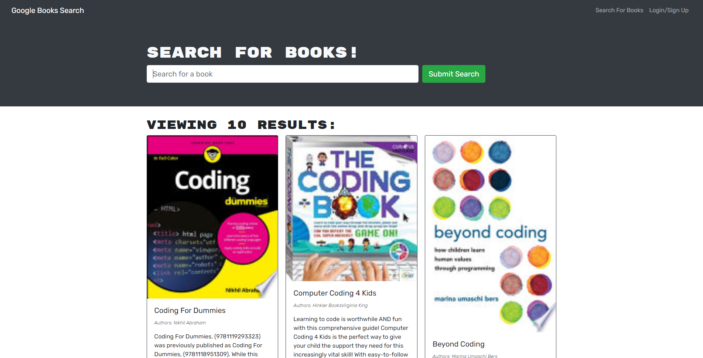

<h1 align="center"> Book Search Engine - Module 21 </h1>

    
    
    
    

    
    

## Table of Contents
- [Table of Contents](#table-of-contents)
- [Description](#description)
- [Screenshot](#screenshot) 
- [Contributing](#contributing)
- [Questions](#questions)

## Description
Refactored a function Google Books API search engine into a GraphQL API that is built using the Apollo Server. The original app was already built but needed to be modified to be able switch the original API into a GraphQL API.

## Link to Live - Github
https://github.com/TheodoreShishkovskiy/book-search-engine

## Link to Live - Heroku
https://tedsbooksearch.herokuapp.com/

## Screenshot

## Contributing
:octocat: [Theodore Shishkovskiy](https://github.com/TheodoreShishkovskiy)

## Questions
✉️ Contact me with any questions: [Email](mailto:tmshishkovskiy@gmail.com) , [GitHub](https://github.com/TheodoreShishkovskiy) 